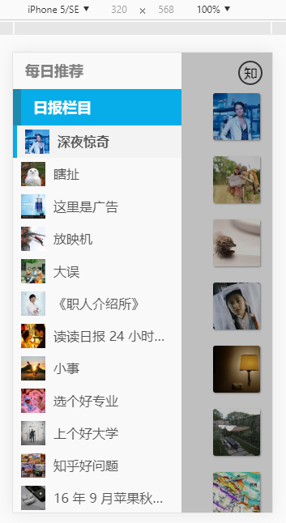
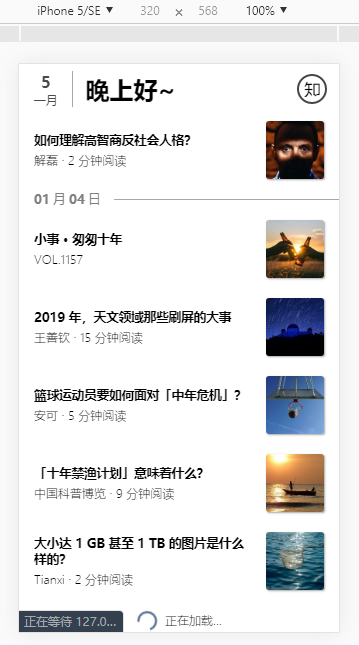
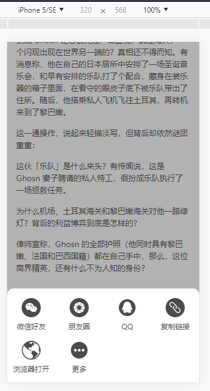
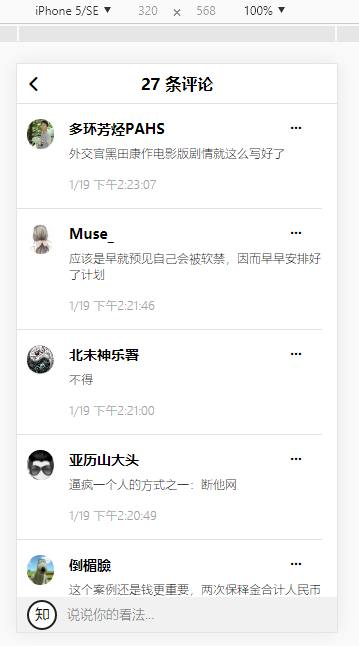

# 模仿知乎日报App
### 知乎日报api: [参考](https://github.com/ZHOUYIJIEQM/zhihudaily/wiki/api%E5%88%86%E6%9E%90)  
### [在线预览(pc请在开发者工具中用手机预览)](http://149.28.24.198:3002)  
用vue, vue-router, vuex, axios写的移动版知乎日报,主要包括了日报的每日推荐,日报各个栏目。  
组件包括了轮播,首页头部,侧边栏,分享模块,加载提示,文章底部条,文章列表。  
因为知乎的api限制跨域,所以用node做代理,项目运行前需要先运行代理:  
```
node proxy.js
```

## 运行

``` 
# install dependencies
npm install

# serve with hot reload at localhost:8080
npm run dev

# build for production with minification
npm run build

# build for production and view the bundle analyzer report
npm run build --report
```


## <a id="预览图">预览</a>  
- [首页](#首页)  
- [上拉加载](#上拉加载)  
- [下拉刷新](#下拉刷新)  
- [侧边栏(点击头部的日期展开侧边栏)](#侧边栏(点击头部的日期展开侧边栏))  
- [文章页面](#文章页面)  
- [文章分享](#文章分享)  
- [评论页面](#评论页面)  

### <a id="侧边栏(点击头部的日期展开侧边栏)">[侧边栏(点击头部的日期展开侧边栏)](#预览图)</a>

### <a id="首页">[首页](#预览图)</a> 
  
  
### <a id="上拉加载">[上拉加载](#预览图)</a>

### <a id="下拉刷新">[下拉刷新](#预览图)</a>

### <a id="文章页面">[文章页面](#预览图)</a>

### <a id="文章分享">[文章分享](#预览图)</a>

### <a id="评论页面">[评论页面](#预览图)</a>
  

仅用于学习使用!

