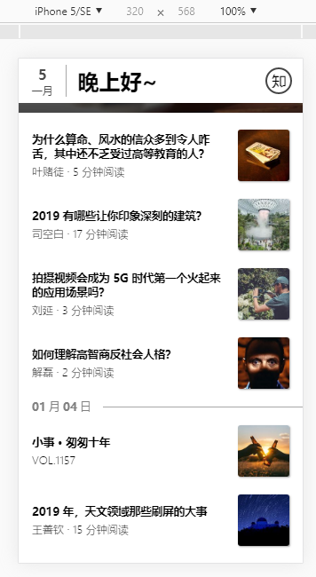

# zhihudaily
用vue, vue-router, vuex, axios写的移动版知乎日报,主要包括了日报的每日推荐,日报各个栏目。
组件包括了轮播,首页头部,侧边栏,分享模块,加载提示,文章底部条,文章列表。
因为知乎的api限制跨域,所以用node写了个代理,项目运行前需要先运行代理:
```
node proxy.js
```

## 运行

``` 
# install dependencies
npm install

# serve with hot reload at localhost:8080
npm run dev

# build for production with minification
npm run build

# build for production and view the bundle analyzer report
npm run build --report
```

## 预览图片:  
### 首页  



### 上拉加载

### 下拉刷新

### 侧边栏

### 文章页面

### 文章分享

### 评论页面
